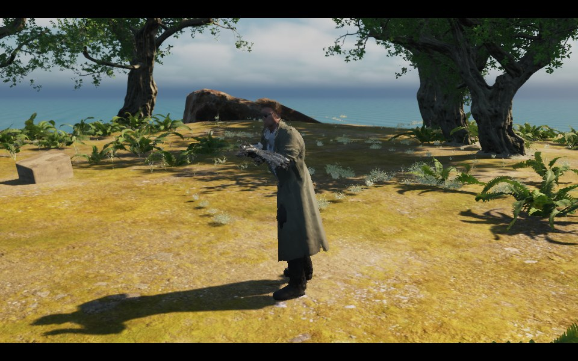

# Lost Expedition

[English](README.md) | [简体中文](README.zh-CN.md)

A third-person adventure prototype built with native C++ in **Unreal Engine 5.8.3**. Explore a tropical island from its sandy shoreline, through the jungle, to a ruined tower on a central highland. Climb the tower using stone handholds, collect relics, and return to the beach.


## Screenshots

Actual Unreal Engine captures from the current island level.

**Beach and jungle approach**


**Ruined tower on the highland**


**Playable wall climbing**


## Character animations

The [action system upgrade plan](Docs/ACTION_SYSTEM_PLAN.md) records the implementation stages and remaining animation dependencies.

The visible hero is now **TwinBlast ActionHero**, a detailed male character included in Epic's free [Game Animation Sample](https://www.fab.com/listings/880e319a-a59e-4ed2-b268-b32dac7fa016). His long coat and mechanical forearms give him a science-fiction action style. Ground Motion Matching, firearm layers and climbing are retargeted to his rig. `-LegacyExplorer` selects the previous CC0 Diesel character.



Wall climbing retains **reach and probe → Space to jump and grab → secure catch**. Imported Epic motion capture now supplies the ground jump, jump-to-wall and rooftop pull-up. Wall-to-wall transfers combine captured upper-body reach with the existing authored wall push-off and leg tuck; a dedicated hanging-leap mocap library is still needed. Contact IK runs once on the visible rig, releases during flight and uses hand axes calibrated from that model's skeleton. See the [wall climbing guide](Docs/WALL_CLIMB.md) for exact coverage and restoration.


[Watch the full 60 fps climbing review](Docs/Images/wall-climb-60fps.mp4). This is a fixed-timestep Unreal render, not a hardware frame-rate benchmark.

Pistol and rifle fire use the official UE mannequin animation sequences, blended into the upper body over the existing locomotion pose. The weapon follows the animated hand; successive rifle shots retrigger recoil, and recovery blends back into movement. Aim elevation follows the camera. Official reload and equip clips share the upper-body layer; Pose Search databases supply the locomotion pose for unarmed, pistol and rifle movement. Consecutive shots crossfade recoil instead of resetting the arm pose.

Full-body action transitions retain the outgoing pose and velocity with critically damped offsets evaluated before contact IK. The finished action pose is retargeted to the clothed character; contact correction keeps the weapon and wall holds aligned with his proportions. Ground acceleration, braking, speed changes, and camera-facing rotation are smoothed.


Ground locomotion now uses **Motion Matching / Pose Search**, with three databases containing 51 official template clips and 2,910 indexed poses. Recorded pose history and predicted movement select animation frames; database changes, jump/landing blends and the existing upper-body weapon layers are integrated. Setup and coverage are documented in the [Motion Matching guide](Docs/MOTION_MATCHING.md).


## Getting started

This repository contains source code, configuration, generation scripts, test reports, and compressed README screenshots and animation previews. Game models, textures, maps, full-resolution captures, build output, and saves stay local. **A fresh clone requires asset restoration and map generation before it can be played.** Follow the [asset sources and restoration guide](Docs/ASSETS.md) for download links and exact import paths.

The macOS scripts default to `/Users/Shared/Epic Games/UE_5.8`. Update that path for your installation. Other platforms require the corresponding Unreal C++ toolchain and build commands.

| Script | Purpose |
| --- | --- |
| [`Scripts/OpenEditor.command`](Scripts/OpenEditor.command) | Open the editor at the island overview |
| [`Scripts/Play.command`](Scripts/Play.command) | Start the game from the beach, or resume a saved checkpoint |
| [`Scripts/PlayTower.command`](Scripts/PlayTower.command) | Start beside the tower to try wall climbing; keeps existing saves |
| [`Scripts/Build.command`](Scripts/Build.command) | Build the editor module |
| [`Scripts/SetupMotionMatching.command`](Scripts/SetupMotionMatching.command) | Generate the Pose Search schema, databases and compiled AnimBlueprint |
| [`Scripts/SetupMocap.command`](Scripts/SetupMocap.command) | Migrate TwinBlast and selected Epic mocap from the downloaded sample and build retarget assets |
| [`Scripts/SetupExplorer.command`](Scripts/SetupExplorer.command) | Import the clothed character, build the IK retargeter and author wall-climbing sequences |
| [`Scripts/WallClimbReview.command`](Scripts/WallClimbReview.command) | Capture the reach, Space leap and secure catch stages |
| [`Scripts/MotionMatchingReview.command`](Scripts/MotionMatchingReview.command) | Capture actual matched movement and combat |
| [`Scripts/SmokeTest.command`](Scripts/SmokeTest.command) | Run checks in the actual game world |
| [`Scripts/AnimationReview.command`](Scripts/AnimationReview.command) | Capture repeatable climbing and firing animation frames |

The map's internal asset path remains `/Game/Maps/CliffSanctuary`.

## Island and route

1. Start on the southwest beach, pass through coconut palms, and follow a continuous forest trail onto the central highland.
2. The highland rises approximately **22 m above sea level**. The tower's rooftop is another **28 m above the highland**, with window openings, broken upper walls, fallen masonry, roof beams, and wall plants.
3. Follow **23 stone handholds** on the west wall. The route includes two horizontal transfers and a final mantle onto the rooftop.
4. Checkpoints are located on the beach, in the forest, at the tower base, and on the rooftop. Approach a blue beacon and press **E** to save and restore health.
5. Collect one relic each from the beach, forest, and rooftop. Find the highland key, unlock the tower's east doorway, and return to the beach exit with all three relics.

## Controls

| Action | Input |
| --- | --- |
| Move / look | WASD / mouse |
| Sprint / jump | Left Shift / Space |
| Probe the first handhold / interact | E |
| Probe a higher / lower hold | W / S |
| Probe a hold on the left / right | A / D |
| Jump to the selected hold | Space |
| Mantle from the final handhold | Space |
| Descend from the rooftop | Approach the west opening, face outward, and press E |
| Let go | Left Ctrl |
| Aim / fire | Right / left mouse button |
| Pistol / rifle / reload | 1 / 2 / R |
| Medkit / grenade | Q / G |
| Adventure journal / reset this island's save | Tab / F5 |

Climbing includes facing checks, adjacent handhold selection, collision sweeps, horizontal transfers, descent, rooftop mantling, and grabbing the edge from above. The probe retains a supporting hand; a collision-swept leap ends in a separate secure catch. Intermediate holds cannot be mantled; horizontal gaps require **A/D**.

## Combat, items, and saves

The prototype includes a pistol, rifle, reloading, over-the-shoulder aiming, hit damage, grenades with blast occlusion, medkits, keys, relics, and checkpoint saves.

The island uses the separate `LostExpedition_Island_Checkpoint` save slot to avoid restoring positions from the previous map. Older saves are preserved.

## Generation and validation

After restoring the required assets, run this in your system terminal to generate the original coconut palm mesh and download the sand textures:

```sh
python3 Scripts/prepare_island_assets.py
```

After compiling and restoring template assets, run `Scripts/SetupMotionMatching.command`, download Game Animation Sample **5.8**, and run `Scripts/SetupMocap.command /absolute/path/to/GameAnimationSample.uproject`. This migrates the selected character/actions, builds the retargeters and generates supporting wall poses. Restart Unreal afterward. The optional legacy character uses `Scripts/SetupExplorer.command /absolute/path/to/Diesel.glb`.

Then execute `Scripts/setup_scene.py` through Unreal's **Tools → Execute Python Script** menu. This regenerates the map and overwrites manual changes to that generated level; save your own edits elsewhere first.

| Source | Responsibility |
| --- | --- |
| [`IslandTerrain.h`](Source/LostExpedition/IslandTerrain.h) | Island outline, highland, and trail height functions |
| [`ExpeditionWorld.cpp`](Source/LostExpedition/ExpeditionWorld.cpp) | Continuous terrain, ocean, vegetation instances, and ruined tower |
| [`ExpeditionTower.h`](Source/LostExpedition/ExpeditionTower.h) | Handhold coordinates and tower dimensions |
| [`ExplorerCharacter.cpp`](Source/LostExpedition/ExplorerCharacter.cpp) | Traversal, combat, and saves |
| [`ExplorerAnimation.cpp`](Source/LostExpedition/ExplorerAnimation.cpp) | Official firearm animation blending, staged climbing limbs, and pull-up poses |
| [`ExplorerMotionMatching.cpp`](Source/LostExpedition/ExplorerMotionMatching.cpp) | Pose Search query trajectory, weapon database changes and evaluated selection diagnostics |
| [`ExpeditionMotionMatchingSetup.cpp`](Source/LostExpedition/ExpeditionMotionMatchingSetup.cpp) | Rebuild indexed databases and the compiled Motion Matching AnimGraph |
| [`ExplorerPoseComponent.cpp`](Source/LostExpedition/ExplorerPoseComponent.cpp) | Preserve pose and velocity across action transitions |
| [`ExplorerVisualComponent.cpp`](Source/LostExpedition/ExplorerVisualComponent.cpp) | Runtime IK retargeting to the clothed character |
| [`create_island_materials.py`](Scripts/create_island_materials.py) | Blended sand and rock, shallow water, shoreline foam, and vegetation materials |

The current suite passes **127 checks with zero failures**. The [runtime report](Docs/runtime-test.txt) covers the beach-to-tower route, all 23 handholds, the three climbing stages, explicit Space input and one-command buffering, ground-probe cancellation, moving obstacles, 30/60/120 Hz jump paths, the clothed character's pelvis and wall contacts, rooftop ascent/descent, ground Motion Matching, weapon layers, items and saves. These results apply to the configured local project; rerun them after restoring assets in a fresh clone.

For repeatable screenshots, run `Scripts/editor_view.py` at editor startup with `-AdventureCapture -AdventureCaptureExit`. It writes the full-resolution island views to `Docs/`. Launching the game with `-WatchtowerVisualReview` captures a real wall-gripping state to `Docs/tower-gameplay.png` and exits. Only the compressed copies in `Docs/Images/` are included in Git.

`Scripts/WallClimbReview.command` captures 630 frames at a 60 Hz animation timestep into `Docs/WallClimbFrames/`; assemble the README preview with `python3 Scripts/assemble_animation_previews.py --wall-climb-only` using Pillow. `Scripts/AnimationReview.command` captures weapon and complete traversal reviews into `Docs/AnimationFrames/`. All source frames remain local. On macOS, encode every frame with `swift -module-cache-path /tmp/lostexpedition-swift Scripts/encode_review_video.swift Docs/WallClimbFrames Docs/Images/wall-climb-60fps.mp4 60 630` (use a new output path). See [the continuity report](Docs/climb-continuity-summary.json) for the measured cases.

## Current scope

This is a single-player adventure prototype. TwinBlast and selected Epic motion-capture clips are installed locally. Wall transfers remain a hybrid of captured upper-body motion, authored wall support poses and contact IK; this is not a complete Uncharted-quality climbing library. Ground Motion Matching uses the existing 51 official template loops; dedicated starts/stops and pivots still need expanded coverage. Root-motion Motion Warping, coat physics, rope swinging, audio and cinematic sequences are not implemented. See [Docs/ASSETS.md](Docs/ASSETS.md) for asset sources and restoration.
