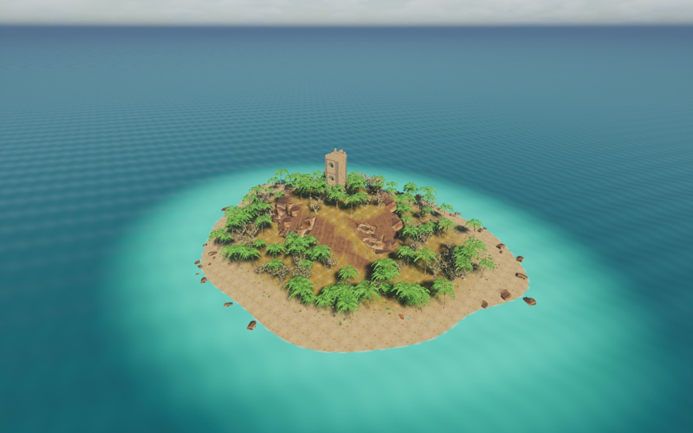
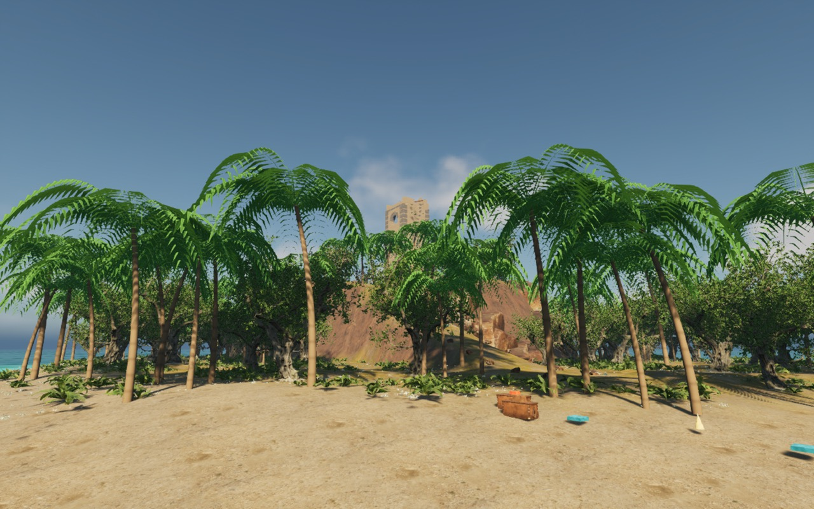
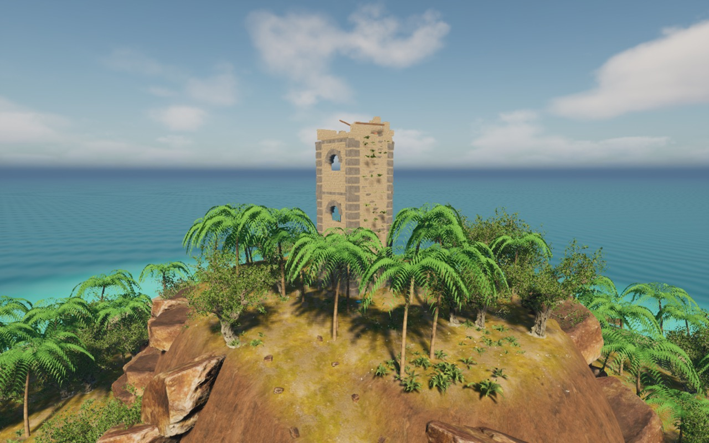
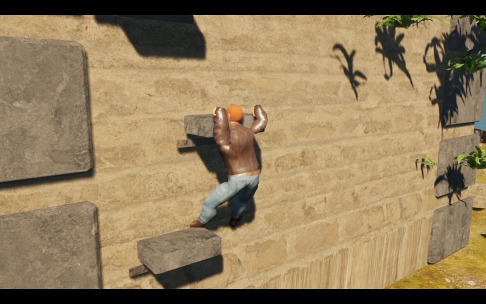
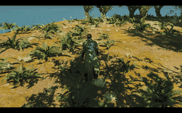
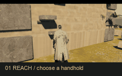
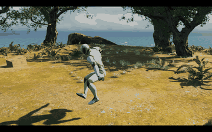

# Lost Expedition / 失落远征

[English](README.md) | [简体中文](README.zh-CN.md)

UE 5.8.3 原生 C++ 第三人称冒险原型。当前关卡为热带海岛：低处是滨海沙滩与浅水，中部是岩石高地，残破塔楼建在高地上；椰子树、乔木、蕨类和草丛形成丛林。塔楼西侧设有可实际攀爬的石把手。

## 场景截图

以下图片均为当前海岛关卡的 Unreal Engine 实际画面。

**沙滩与丛林入口**

**高地上的残破塔楼**

**实际攀爬画面**

地面移动现已接入 **Motion Matching / Pose Search**，使用姿态历史和未来运动轨迹选帧，并衔接换枪、跳跃落地与上半身武器动作。三个数据库分别处理徒手、手枪和步枪。详见[接入与恢复说明](Docs/MOTION_MATCHING.md)。

## 角色动画

[动作系统升级计划](Docs/ACTION_SYSTEM_PLAN.zh-CN.md)记录了实施步骤和仍需接入的动画素材。

攀爬包含抓握过渡、交替换手与抬脚、上攀和横移时的重心移动、屈身撑上塔顶，以及从塔顶反向下攀。持续按方向可连续换把手；短按与反向输入在下一次接触时接续，松开后完成当前动作再停止。脚位通过墙面检测选择，身体位置按肢体可达范围修正。

手枪和步枪分别使用 UE 官方 mannequin 开火动画，叠加到上半身并保留腿部行走。武器跟随动画后的手部，步枪连续开火会反复触发后坐力，动作结束后平滑回到移动姿态；瞄准高度随相机调整。官方换弹与拔枪动作接入上半身层；徒手和两种武器的地面移动由 Pose Search 数据库按轨迹与姿态选帧。连续射击会混合前后两次后坐力，避免重置手臂姿态。

全身切换保留前一姿态及运动速度，以临界阻尼衰减偏移，再求解手脚接触。移动、攀爬与战斗共用一个可见网格和固定武器挂点。地面加速、制动、速度切换与朝向相机的转身也做了平滑处理。

## 启动与素材

这是源码仓库，包含代码、配置、生成脚本、测试报告和 README 压缩预览图。模型、贴图、地图、原始全分辨率截图、编译产物及存档只保留在本机，不上传 Git。**新克隆需按 [素材与恢复说明](Docs/ASSETS.md) 补齐资源并生成地图后再 Play。**

- `Scripts/OpenEditor.command`：打开编辑器，默认查看整个海岛。
- `Scripts/Play.command`：从沙滩进入游戏，或继续已有检查点存档。
- `Scripts/PlayTower.command`：直接到残塔下体验石把手攀爬，不清除存档。
- `Scripts/Build.command`：编译编辑器模块。
- `Scripts/SetupMotionMatching.command`：生成 Pose Search 数据库与编译后的动画蓝图。
- `Scripts/MotionMatchingReview.command`：捕获实际匹配的移动与战斗。
- `Scripts/SmokeTest.command`：运行真实游戏世界中的检查。
- `Scripts/AnimationReview.command`：捕获可重复的攀爬与开火动画帧。

Mac 脚本默认使用 `/Users/Shared/Epic Games/UE_5.8`。其他平台使用对应 C++ 工具链构建。内部地图资源名仍为 `/Game/Maps/CliffSanctuary`。

## 场景与路线

1. 从西南侧沙滩出发，穿过椰林，沿连续的林间坡道走向中央高地。
2. 高地约高出海面 22 米；塔顶平台比高地再高 28 米。残塔有窗洞、破损顶墙、断裂屋梁、落石和墙生植物。
3. 塔楼西侧有 23 个凸出的石把手。纵向错位的路线中间需要两次横移，最上方把手可翻上塔顶。
4. 沙滩、林间、塔下和塔顶设有检查点，靠近蓝色信标按 E 保存并恢复生命。
5. 沙滩、树林和塔顶各有一件宝物。找到高地钥匙、打开塔楼东侧门，收齐宝物后返回沙滩出口。

## 操作

| 操作 | 按键 |
| --- | --- |
| 移动 / 视角 | WASD / 鼠标 |
| 奔跑 / 跳跃 | 左 Shift / Space |
| 抓住石把手 / 交互 | E |
| 贴墙向上、向下换手 | W / S |
| 贴墙左右横移 | A / D |
| 最上方把手翻上塔顶 | Space |
| 从塔顶下攀 | 走到西侧缺口，面朝外侧，按 E |
| 松手 | 左 Ctrl |
| 瞄准 / 射击 | 鼠标右键 / 左键 |
| 手枪 / 步枪 / 换弹 | 1 / 2 / R |
| 医疗包 / 手雷 | Q / G |
| 冒险日志 / 清除本海岛存档重开 | Tab / F5 |

攀爬包含朝向检测、相邻把手选择、碰撞扫描、横移、下攀、登顶和反向抓边。手脚分阶段运动，伸向下一个把手时保留另一只手支撑。中间把手不能直接翻成站立状态；横向缺口需要使用 A/D。

## 其他玩法

保留手枪、步枪、换弹、肩后瞄准、命中伤害、手雷及爆炸遮挡、医疗包、钥匙、宝物和检查点存档。新海岛使用独立的 `LostExpedition_Island_Checkpoint` 存档槽，避免读取旧地图位置；旧存档未删除。

## 生成与验证

官方模板素材恢复并编译后，运行 `Scripts/SetupMotionMatching.command` 生成数据库与动画蓝图，再重启 Unreal。`Scripts/MotionMatchingReview.command` 可捕获实际匹配移动。

素材恢复后，在系统终端运行 `python3 Scripts/prepare_island_assets.py`，生成原创椰子树并下载沙滩贴图。随后在 Unreal 的 **Tools → Execute Python Script** 中执行 `Scripts/setup_scene.py`。该脚本会覆盖生成地图上的手动修改，请先保存自己的调整。

- `IslandTerrain.h`：岛形、高地与坡道高度函数。
- `ExpeditionWorld.cpp`：连续地形、海水、植被实例与残塔。
- `ExpeditionTower.h`：石把手坐标与塔楼尺寸。
- `ExplorerCharacter.cpp`：攀爬状态、战斗与存档。
- `ExplorerAnimation.cpp`：官方开火动画叠加、分阶段换手换脚与登顶姿态。
- `ExplorerPoseComponent.cpp`：在行走骨骼更新后计算可见动作姿态。
- `Scripts/create_island_materials.py`：沙滩/岩壁混合、浅海、浪花与丛林材质。

当前 **106 项检查通过**。运行结果见 [测试报告](Docs/runtime-test.txt)，覆盖沙滩至塔下的连续通行、全部把手换手、支撑手脚误差、30/60/120 Hz 连续换手、短按缓存、反向与松开后的运动连续性、阻挡、登顶下攀动画、后坐力接续、移动瞄准、换弹拔枪及武器挂接、伤害、道具和存档。该结果来自已配置素材的本机工程；新克隆恢复素材后应重新运行检查。

本机预览为 `Docs/island-overview.png`、`island-beach.png`、`island-tower.png` 和 `island-grips.png`。编辑器启动时执行 `Scripts/editor_view.py` 并增加 `-AdventureCapture -AdventureCaptureExit` 可重新生成。`-WatchtowerVisualReview` 会进入真实抓边状态，生成 `Docs/tower-gameplay.png` 后退出。

Git 中仅包含 `Docs/Images/` 下的压缩预览副本。

`Scripts/AnimationReview.command` 会将固定时间步长的动画帧保存到 `Docs/AnimationFrames/`。使用安装了 Pillow 的 Python 运行 `Scripts/assemble_animation_previews.py` 可生成小体积 GIF；原始帧保留在本地。

当前仍是单人冒险原型。攀爬使用程序生成的肢体姿态，尚无正式动捕攀爬。地面移动已接入真实 Motion Matching / Pose Search：徒手、手枪、步枪三个数据库，共 51 个官方模板动作、2,910 个索引姿态。起停和急转仍需专门的正式动作扩充；根运动 Motion Warping 尚未启用，Game Animation Sample 尚未导入。绳索摆荡、声音与电影演出仍未实现。资源来源见 [素材说明](Docs/ASSETS.md)。
